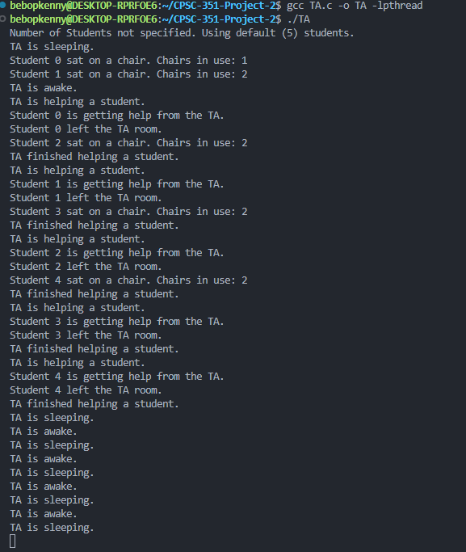

# CPSC 351 Programming Assignment – Sleeping Teaching Assistant


## Section Information
* Section: 09 14061
* Name: Kenny Garcia , Kyler Geesink
* Email: kennygarcia15@csu.fullerton.edu, geesinkk@csu.fullerton.edu
* Contributions: Kenny wrote the student function, Kyler wrote the ta function, and we both wrote the main driver function


## Language Used
* This program is written in C


## Program Overview
This assignment simulates a teaching assistant (TA) who will assist students, while following specific synchronization constraints. The TA can assist only one student at a time, while there can be up to three students waiting in chairs outside the office. If no students need assistance, the TA will be napping. If a student arrives and sees the TA napping, the student will wake the TA. If a student arrives when the TA is busy assisting another student, the student will sit in a waiting chair if there is one available. If there is no waiting chair available, the student will leave.


### Core Concepts
- Uses POSIX threads: one TA thread and multiple student threads
- Uses semaphores for signaling and synchronization
- Uses mutex locks to protect shared counters and ensure correct concurrency behavior


## How to Compile and Run
1. First, ensure that you are on a Linux Operating System and that you have gcc configured to your PATH.
2. Next, place all of the source files into one folder.
3. Open a terminal window and navigate to that folder.
4. Open the terminal and go to the project directory:
```bash
cd CPSC-351-Project-2
```
5. Compile the program by typing in ```gcc``` and link the pthread library:
```bash
gcc TA.c -o TA -lpthread
```
- Execute the program: 
```bash
./TA
```

6. Instead of reading the output of the terminal, look at the screen of a student or at the front page of terminal output which will show students sitting in chairs, waking the TA and also leaving when completed.


### Example Execution
```bash
$ gcc -o sleepingTA TA.c -lpthread
$ ./sleepingTA 5
Number of Students specified. Creating 5 threads.
Student 0 sat on a chair. Chairs in use: 1
TA is helping a student.
```
## Testing Screenshot


- The TA starts sleeping
- Students arrive one by one and sit in chairs if available
- First student to arrive wakes the TA
- The TA helps students in order, one at a time
- Each student prints messages something like:
```bash
Student X is getting help from the TA.
Student X left the TA room.
```
- After helping, the TA goes back to sleep
- Sample terminal output shows the proper way for chair management and thread synchronization

## Special Notes
* Remember to do error checking for system calls (pthread_create, pthread_join, sem_init) every time you use them.
* If you use any more libraries or any scripts you created or someone else created, describe the library or link to the script.
* ChairsCount is protected by a mutex lock to prevent concurrency problems.
* The TA thread is meant to loop infinitely, but you can easily modify it to exit after the student threads finish.